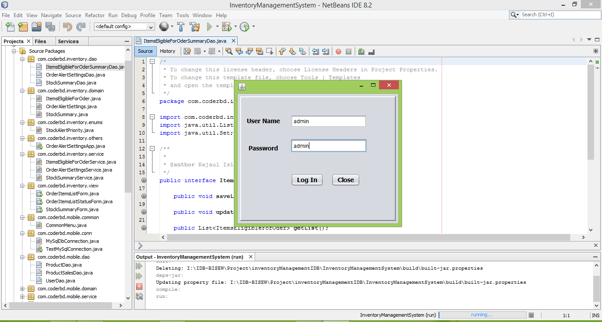
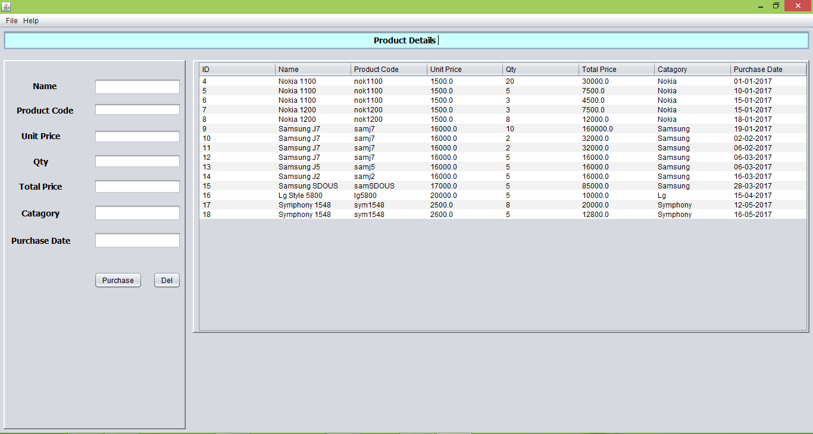
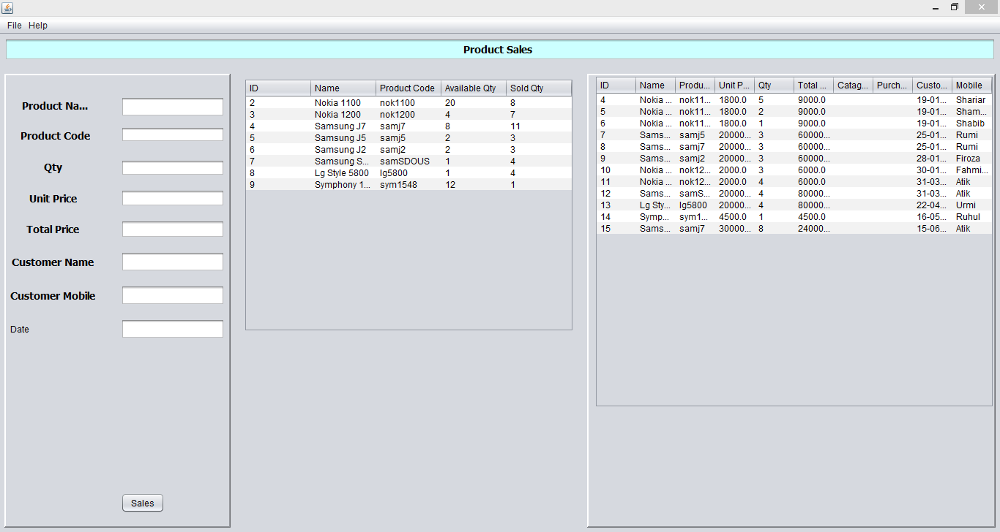
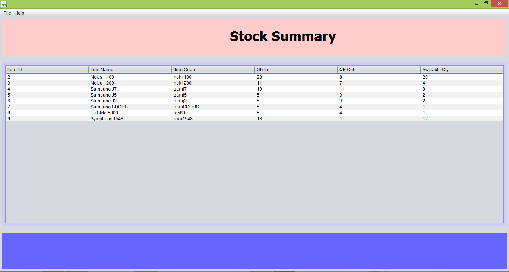
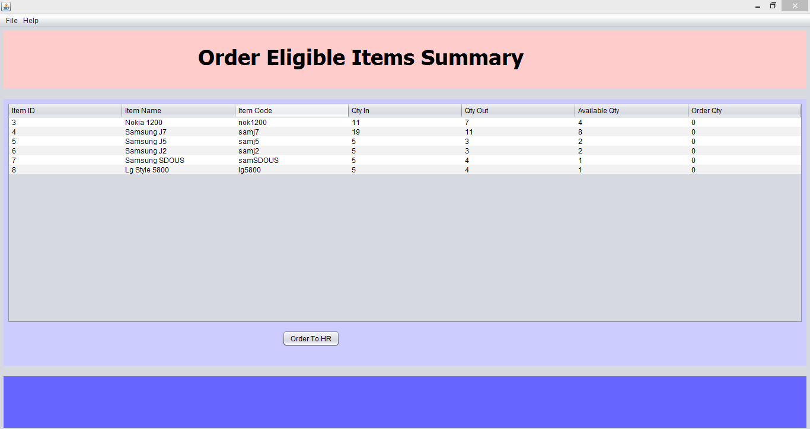
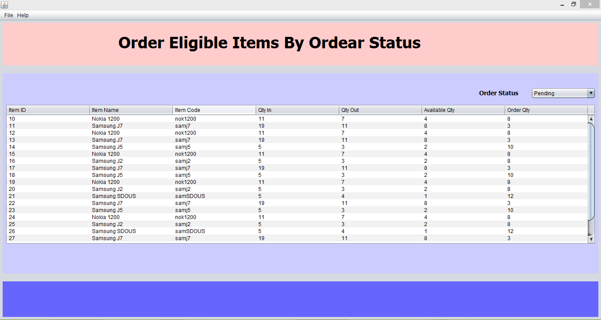

<h1>Name : Inventory Management System</h1>

<h2>About : This project is implemented by following fully OOPs concept</h1>

<h3>Project Features</h3>
<ol>
  <li>User Login</li>
  <li>Details Product Information</li>
  <li>Sales Product</li>
  <li>Product Stock Summery</li>
  <li>Product Eligilable for Order</li>  
  <li>Pending Order</li>
</ol>

<h3>Development Tools &Technologies</h3>
<ul>
  <li>Java Swing</li>
</ul>

<h3>Database</h3>
<ul>
  <li>MySQL</li>
</ul>

<h3>Using IDE for project development</h3>
 Netbeans IDE 8.2

<h3>Username and Password</h3>
 <ul>
  <li>Username: admin</li>
  <li>Password: admin</li>
 </ul>

<h3>Project Image</h3>

<h3>User Login</h3>

<h3>Product Details</h3>

<h3>Sales Product</h3>

<h3>Product Stock Summery</h3>

<h3>Product Eligible for Order</h3>

<h3>Pending Order</h3>

